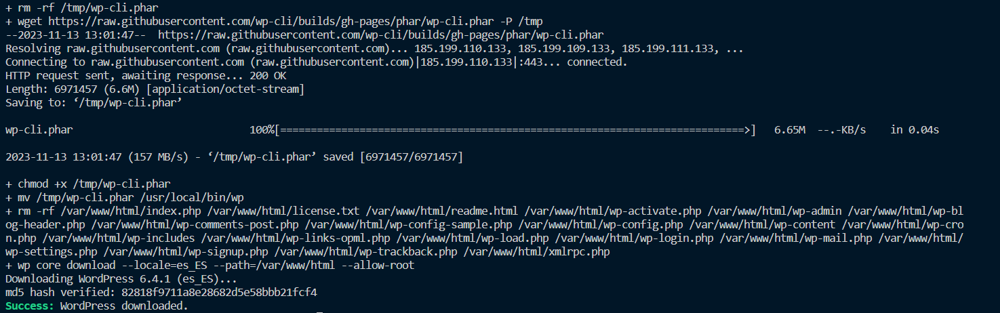

# Practica01-7IAW
Este repositorio es para la Práctica 1 apartado 7 de IAW

### Introducción

- En esta práctica vamos a instalar una herramienta llamada *_WP_CLI_*. Esta herramientas nos permite administrar desde la línea de comandos el panel de administración de _WordPress_

# Nuevo repositorio, copiamos los archivos.

- Como primer apartado lo que tendremos que hacer sera hacer un nuevo repositorio es nuestra página de  *_github_* y importarlo como hemos hecho anteriormente haciendo uso del comando `git clone`.

- De la práctica anterior [Práctica 1 - 06 IAW](https://github.com/kinoibanez/Practica01-6IAW) deberemos copiar las carpetas junto con su contenido.

- Las carpetas que tenemos que copiar son las siguientes:

1. conf con su respectivo *_000-default.cnf_*

2. htaccess con su respectivo *_.htacces_*

3. Scripts con sus respectivos scripts dentro.

# Creación del nuevo script.

- Para implementar esta nueva herramienta tendremos que crear un nuevo script llamado *_deploy_wordpress_with_wpcli.sh_* 

- Dentro de este script iremos añadiendo las nuevas lineas que tendremos que ir configurando, antes de nada, es importante tener el archivo *_.env_* bien configurado. Ya que más adelante, tendremos que hacer uso de el.

- Las primeras lineas del script son las que utilizamos siempre para actualizar && upgradear la máquina.

    ```
    #!/bin/bash

    #Esto muestra todos los comandos que se van ejecutando
    set -ex 

    #Actualizamos los repositorios
    
    apt update

    #Actualizamos los paquetes de la máquina 

    apt upgrade -y

    #Incluimos las variables del archivo .env

    source .env

    ```

- Una vez hecho esto, antes de comenzar con la instalación deberemos borrar instalaciones anteriores dentro del directorio `/tmp` que será donde queremos alojar la descarga.

    `rm -rf /tmp/wp-cli.phar` 

## Descargamos el paquete desde la página oficial.

- Para descargar el paquete podemos hacerlo con *wget* o *curl*, pero en el caso de que hiciesemos uso de *curl* tendremos que hacer uso de la extensión `-O` para que se guarde de manera permanente el archivo.

    De todas maneras, vamos a usar *_wget_*

    Haciendo uso del comando: 
    ``` 

    # Descargamos la utilidad de wp-cli

    wget https://raw.githubusercontent.com/wp-cli/builds/gh-pages/phar/wp-cli.phar -P /tmp 


    ```
    
    Recordemos que el uso de *_-P_* nos permite guardar el archivo dentro del directorio que indiquemos.


## Damos permisos al archivo wp-cli.phar

- Una vez descargado el archivo tendremos que darle permisos al archivo llamado *_wp-cli.phar_*, le damos permisos de ejecución con el comando: `chmod +x [nombre_del_archivo]`

    Esto lo hacemos debido a que es un archivo que contiene una serie de comandos y consultas de la herramienta que estamos instalando. Más tarde tendremos que hacer un ´mv´ para moverlo a otro directorio, por eso nos conviene que tenga los permisos dados.


### Movemos el archivo anterior.

- Tendremos que mover este archivo al directorio `/usr/local/bin` debido a que sabemos que en este directorio se almacenan todos los comandos del sistema.

    Lo movemos de la siguiente manera: 
    ```
    #Movemos el archivo al directorio /usr/local/bin que almacena el listado de comandos del sistema.

    mv /tmp/wp-cli.phar /usr/local/bin/wp         #wp es renombrado

    ```

    Hemos renombrado el archivo justo a la hora de moverlo, por eso ahora se llamará wp.

- Después de realizar todos estos pasos si hacemos `wp` en la consola, debería de salirnos la ayuda del comando.

    

## Descargamos el código fuente de la página.

- Para las siguientes lineas del script tendremos que descargar el código fuente de la página, pero antes es muy importante que borremos instalaciones previas para que si lanzamos el script varias veces, no se repita la instalación del código siempre.

    Como ya sabemos para eliminar el contenido de algo tenemos que hacer uso del comando siguiente: 
    ```
    #Eliminamos instalaciones previas de wordpress

    rm -rf /var/www/html/*

    #Descargamos el codigo fuente de wordpress en /var/wwW/html

    wp core download --locale=es_ES --path=/var/www/html --allow-root


    ```

    También hemos añadido la linea de código que tenemos que implantar para descargarlo pero... ¿Que és Path? 

    *_Path_* es un comando que nos redirige automáticamente al directorio que le indiquemos, de manera que si hacemos uso de el con el simbolo `=` estará enfocando todo lo que le digamos a ese directorio.

    ¿Y *--allow-root_*? AllowRoot nos permite que guardemos lo que estemos modificando con el uso de Path como usuario root.

    Pero queda algo, y ¿*_--Locale=es_ES_*? Este apartado como su propio nombre indica nos permite descargar el código fuente en Español.


    Si no hacemos de *_AllowRoot_* a la hora de descargar el código nos saldrá el siguiente error!!


    

- Si lanzamos el comando de manera correcta y con todo lo anterior añadido, la consola te mostrará por pantalla que la instalación se ha realizado correctamente.

    


## Añadimos la base de datos y nuevas configuraciones.

- Ahora tendremos que hacer uso del .env, donde ya tendremos configurados una serie de variables que anteriormente hemos usado, pero... ahora toca cambiarlas y añadir algunas nuevas, de manera que el *_.env_* que se nos queda es así:

    ```
    #Configuración de las variables

    #BLOQUE 1
    -------------------------------------------------------
    WORDPRESS_DB_NAME=wordpress
    WORDPRESS_DB_USER=wp_user
    WORDPRESS_DB_PASSWORD=wp_pass
    WORDPRESS_DB_HOST=localhost
    IP_CLIENTE_MYSQL=localhost
    -------------------------------------------------------
    #Variables de la Practica 5. 
    #BLOQUE2

    CERTIFICATE_EMAIL=demo@demo.es
    CERTIFICATE_DOMAIN=practica-https.ddns.net
    -------------------------------------------------------
    #Configuramos variables wodpress 
    #BLOQUE3

    WORDPRESS_TITLE="Sitio web de IAW"
    WORDPRESS_ADMIN_USER=admin
    WORDPRESS_ADMIN_PASS=admin
    WORDPRESS_ADMIN_EMAIL=demo@demo.es
    -------------------------------------------------------
    ```


- En las últimas lineas hemos añadido las nuevas variables (Bloque 3) que tenemos que utilizar en esta práctica, junto con las variables anteriores, a las cuales les hemos cambiado lo que sigue después del `=` (Bloque 1)

    Esas variables que hemos añadido nuevas nos servirán para el script una vez hayamos lanzado la base de datos con la creación de sus respectivos usuarios como hemos hecho anteriormente.

    ```

        # Creamos la base de datos y el usuario de base de datos.

        mysql -u root <<< "DROP DATABASE IF EXISTS $WORDPRESS_DB_NAME"
        mysql -u root <<< "CREATE DATABASE $WORDPRESS_DB_NAME"
        mysql -u root <<< "DROP USER IF EXISTS $WORDPRESS_DB_USER@$IP_CLIENTE_MYSQL"
        mysql -u root <<< "CREATE USER $WORDPRESS_DB_USER@$IP_CLIENTE_MYSQL IDENTIFIED BY '$WORDPRESS_DB_PASSWORD'"
        mysql -u root <<< "GRANT ALL PRIVILEGES ON $WORDPRESS_DB_NAME.* TO $WORDPRESS_DB_USER@$IP_CLIENTE_MYSQL"


- Como siguiente paso de este apartado, tendremos que crear el archivo *_wp config create_*, el cual hará uso de las variables que hemos mencionado anteriormente, pero...

    Este archivo tendremos que introducirlo en el script de la siguiente manera: 

    ```

    #Crear el archivo .config, podemos comprobar haciendo un cat /var/www/html/wp-config.php si estan bien las variables

    wp config create \
    --dbname=wordpress \
    --dbuser=wp_user \
    --dbpass=wp_pass \
    --path=/var/www/html \
    --allow-root

    ```
 
    Como podemos observar, las variables hacen referencia a las variables que anteriormente hemos creado!!!! Hasta el primer bloque. 

- En el caso de que queramos comprobar que *_wp_core_* se ha instalado de manera correcta y que todo esta bien configurado, podemos comprobar haciendo un `cat` o un `less` del directorio donde hemos descargado todo lo anterior, en este caso `/var/www/html`

    Nos deberá de salir de la siguiente manera:

    


## Siguiente parte del script, archivo wp core install

- Sin dejar de lado el apartado anterior, tendremos que implementar el último bloque de comandos, ahora sí, con las variables del *_bloque 3_* bien configuradas para su correcto funcionamiento.

    
    ```
    #Instalamos el directorio WORDPRESS con las variables de configuración en .env
       
        wp core install \
        --url=$CERTIFICATE_DOMAIN \
        --title="$WORDPRESS_TITLE"\
        --admin_user=$WORDPRESS_ADMIN_USER \
        --admin_password=$WORDPRESS_ADMIN_PASS \
        --admin_email=$WORDPRESS_ADMIN_EMAIL \
        --path=/var/www/html \
        --allow-root

    ```
   
    Si esta realizado de manera correcta y las variables están bien, deberán salir de la siguiente manera en la linea de comando:


    

- Ya podremos acceder a nuestro *_WordPress_* configurado de manera correcta, en el caso de que quisiesemos entrar como admin, en la url tendremos que hacer uso de `https://[nombre_del_dominio]/wp-admin` y asi podremos seguir configurando pero como administrador.

    


## Instalamos un tema a través de la linea de comandos.

- Queremos cambiar el tema para personalizar nuestro wordpress a través de la linea de comandos, entonces, lo haremos de la siguiente manera:

1. Hacemos uso del comando siguiente: `sudo wp  theme install [nombre_del_tema] --activate list --path=/var/www/html --allow-root`

2. Escogemos un tema en *_Wordpress_*, el que más nos guste y lo ejecutamos.

    

3. En nuestro panel de WordPress podemos comprobar los temas que hemos instalado.

    


## Instalar un pluggin nuevo.


- Podemos hacer uso de la página de [Jose Juan apartado 1.4 Comandos Utiles](https://josejuansanchez.org/iaw/practica-wp-cli/index.html) para ver una serie de comandos para actualizar todos los pluggins, o los temas, o comprobar la versión del core, etc...


    Vamos a seguir el primer ejemplo que pone en la página que hemos mencionado anteriormente y haciendo uso del siguiente comando: `sudo wp plugin install [Nombre_del_pluggin] --activate --path=/var/www/html --allow-root` vamos a instalarlo.

    

    Se ha instalado de manera correcta como podemos observar, ahora vamos a probar nosotros con alguno nuevo que no sea como el del ejemplo

    Vamos a instalar un *_pluggin_* llamado Gutenberg.

    

    Y si queremos comprobar que la instalación se ha realizado de manera correcta, accedemos directamente el apartado de *_pluggins_* en nuestra página de WordPress y podremos ver que esta bien instalado:

    


